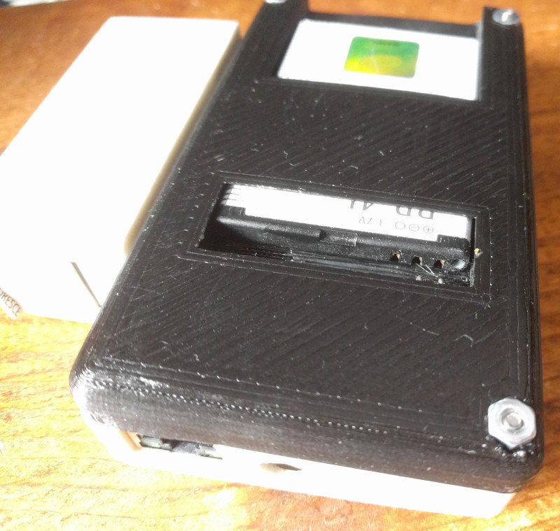

# uradmonitor_kit1

A hackable open source DIY Geiger Counter Kit with a network interface to the
uRADMonitor servers

Project page: 
[http://www.uradmonitor.com/open-source-uradmonitor-kit1/](http://www.uradmonitor.com/open-source-uradmonitor-kit1/)

See the [wiki](https://github.com/radhoo/uradmonitor_kit1/wiki) for more
details.

My fork has some bug fixes and extra features:

- optional BME280 for temperature, pressure and humidity monitoring
- max/min/mean statistics, reported in JSON over ethernet
- sends CSV out the serial port every 10 seconds; the idea is to use an 
  [AdaLogger](https://github.com/ec1oud/adalogger-serial) to log to an SD card
  for mobile surveys
- design for a 3D printed case, with a slot for an old Nokia battery (like
  BP-3L BP-4L BV-4D or any with the same width and pinout).  I used diode legs
  for contacts, which were a bit fiddly to mount but ended up working well
  enough.  One diode is needed anyway for protection, and to drop from 3.7-4V
  down to 3-3.3V.  I didn't bother with a power switch; inserting the battery
  turns it on.

