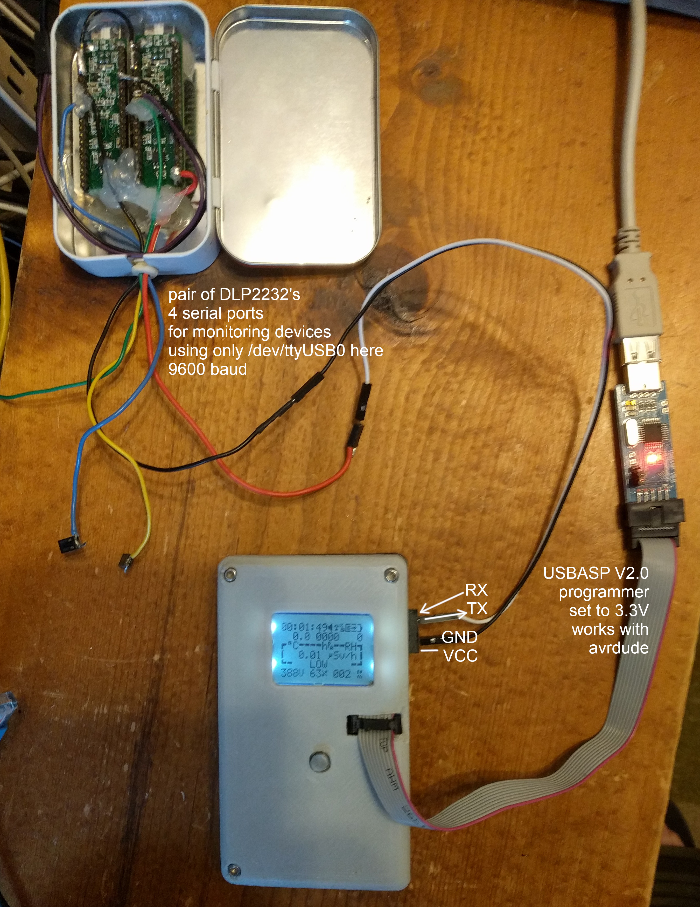

# uradmonitor_kit1

A hackable open source DIY Geiger Counter Kit with a network interface to the
uRADMonitor servers

Project page: 
[http://www.uradmonitor.com/open-source-uradmonitor-kit1/](http://www.uradmonitor.com/open-source-uradmonitor-kit1/)

See the wiki for more details.

My fork has some bug fixes and extra features:

- optional BME280 for temperature, pressure and humidity monitoring
- max/min/mean statistics, reported in JSON over ethernet
- sends CSV out the serial port every 10 seconds; the idea is to use an 
  [AdaLogger](https://github.com/ec1oud/adalogger-serial) to log to an SD card
  for mobile surveys

